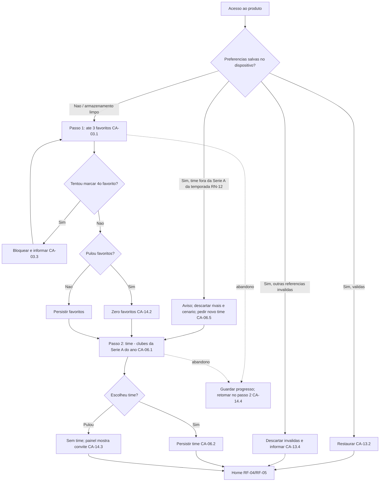
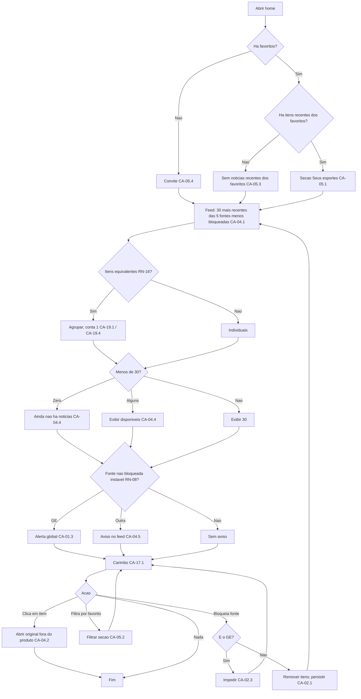
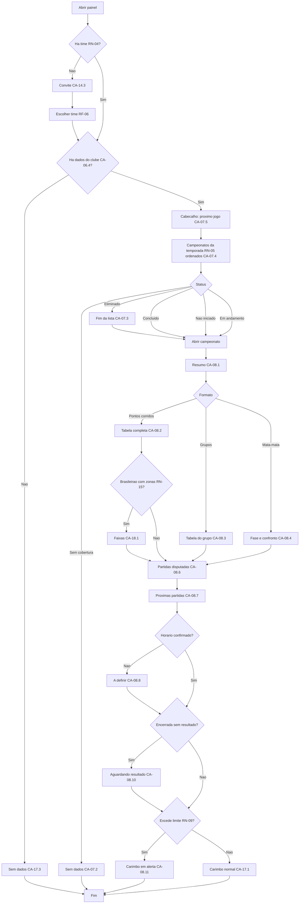
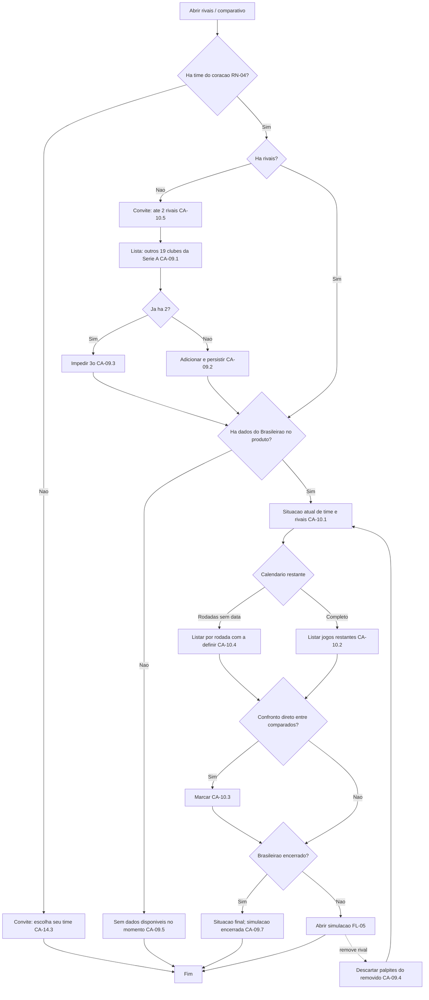
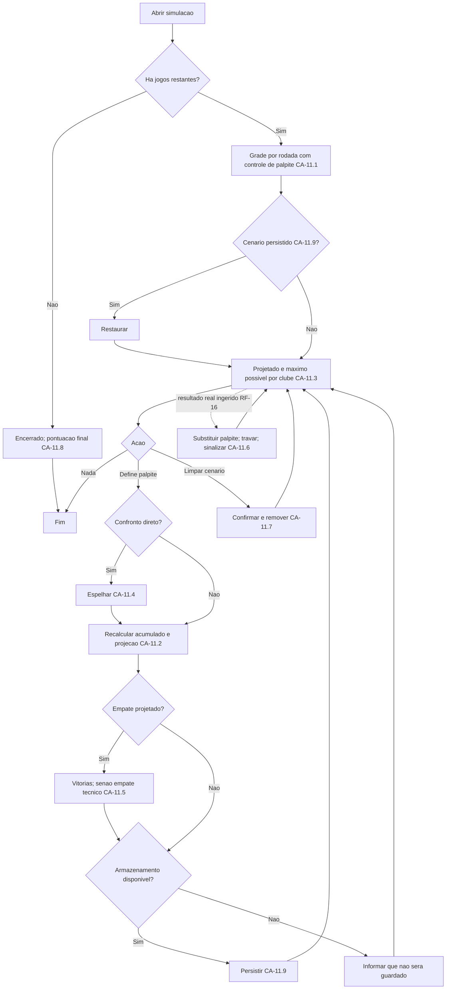
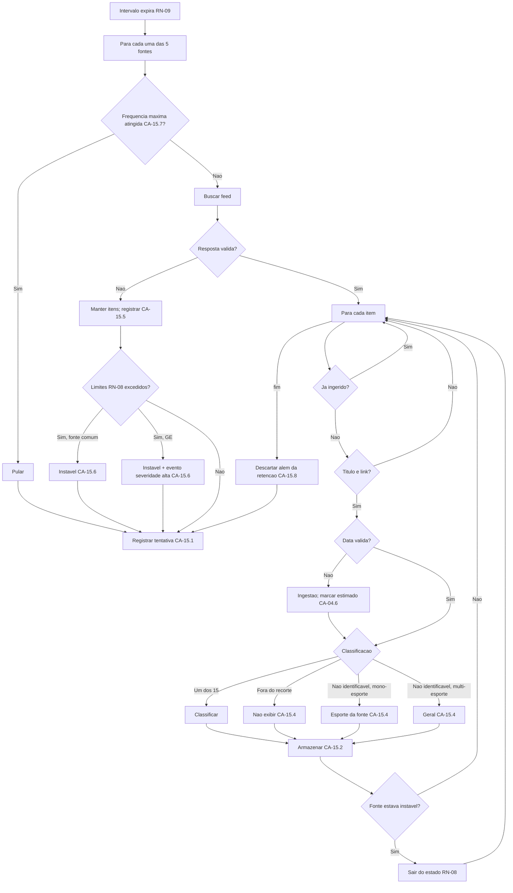
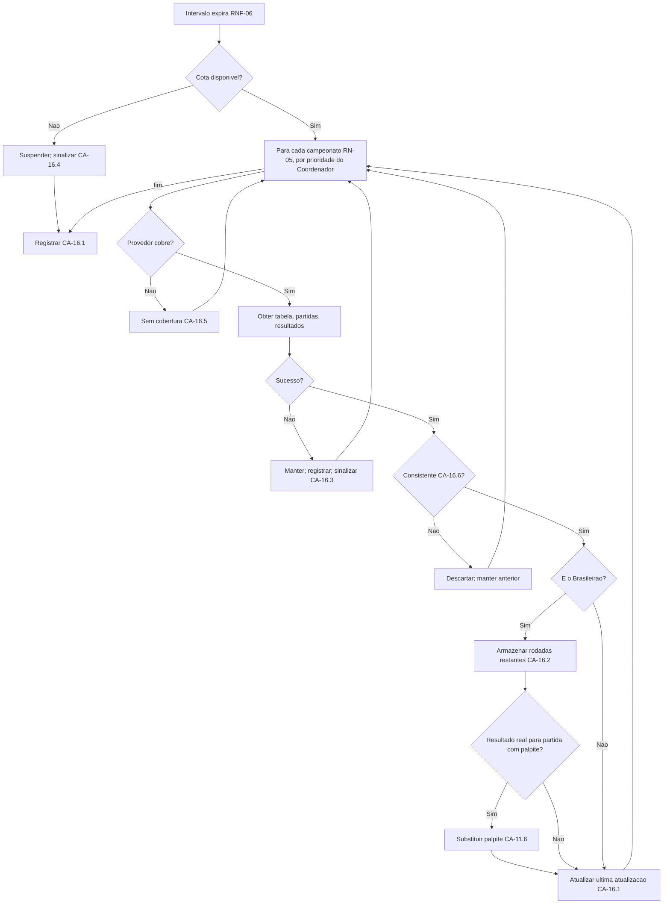

# PRD-TECNICO.md — SportsLM

**Status**: rascunho — Loop A, rodada 3 (2026-09-05)
**Autor**: Gestor (chapéu Business Analyst)
**Base**: `.md/PRD.md` rodada 3 (liberado pelo chapéu PM em 2026-09-05, stakeholder
alignment check limpo) e `.md/CTO-REVIEW.md` (Gate 1 + adendos das rodadas 2 e 3).

Este documento detalha o que o produto faz e como se verifica que faz — **não**
decide arquitetura, stack, provedor, protocolo de integração nem modelo de dados.
Escolhas técnicas inevitáveis estão marcadas **"decisão em aberto para o
Coordenador"**. Números sem fonte estão marcados **"a confirmar"**.

Contexto que atravessa todo o documento **[STAKEHOLDER, rodada 3]**: a aplicação é
um **protótipo**, sem prazo e sem compromisso de lançamento comercial nesta fase;
sem qualquer funcionalidade de IA/LLM; times elegíveis = clubes da Série A do ano
corrente; catálogo fechado em 5 fontes; simulação só entre time e rivais.

Rastreabilidade: RF cita o RAN do `PRD.md`; RN, FL, I e P/R são numerados para
referência cruzada. Mudanças da rodada 3 estão sinalizadas com **[R3]**.

---

## 1. Requisitos Funcionais

Formato: user story → casos de exceção → critérios de aceite EARS (`WHEN` gatilho /
`GIVEN` pré-condição / `THE SYSTEM SHALL` comportamento).

### RF-01 — Catálogo fixo de 5 fontes (RAN-01, Must) [R3]

**Como** torcedor, **eu quero** ver as 5 fontes do produto, com nome, esportes que
cobre e estado, **para que** eu saiba de onde vem cada notícia e possa bloquear as
que não confio.

Catálogo (RN-19; verificação em 5.2): **GE — ge.globo (obrigatória, não
bloqueável)**; ESPN Brasil; Gazeta Esportiva; Terra Esportes; UOL Esporte
(candidata a confirmar pelo Coordenador — substitutos ordenados: Folha Esporte,
Placar).

Casos de exceção:
- E1: fonte instável (RN-08).
- E2: GE indisponível (RN-03).
- E3: 5ª fonte substituída antes do desenvolvimento (RN-19).

Critérios de aceite:
- CA-01.1 — WHEN o torcedor abre a lista de fontes, GIVEN o catálogo configurado,
  THE SYSTEM SHALL listar exatamente as 5 fontes com nome, esportes cobertos e
  estado (ativa / bloqueada / instável), com o GE marcado "fonte fixa".
- CA-01.2 — WHEN a lista é exibida, GIVEN uma fonte instável (RN-08), THE SYSTEM
  SHALL exibir "instável desde <data/hora>" sem removê-la.
- CA-01.3 — WHEN a lista é exibida, GIVEN o GE instável, THE SYSTEM SHALL exibir o
  alerta em destaque no cabeçalho da home (RN-03).
- CA-01.4 — WHEN o catálogo é configurado, GIVEN RN-01/RN-13/RN-19, THE SYSTEM
  SHALL conter apenas fontes com feed oficial gratuito e termos compatíveis; a
  troca da 5ª fonte por um substituto é alteração de configuração, não de código
  (I-25).

### RF-02 — Bloqueio de fontes (RAN-02, Must)

**Como** torcedor, **eu quero** bloquear fontes com efeito imediato, **para que**
meu feed não mostre notícias de quem não confio.

Casos de exceção:
- E1: tentativa de bloquear o GE.
- E2: bloqueio das 4 fontes bloqueáveis (só resta o GE).

Critérios de aceite:
- CA-02.1 — WHEN o torcedor bloqueia uma fonte bloqueável, GIVEN estava ativa, THE
  SYSTEM SHALL remover imediatamente da listagem (feed e seção de favoritos) as
  notícias dessa fonte, sem recarregar a página, e persistir (RF-13).
- CA-02.2 — WHEN o torcedor desbloqueia, GIVEN estava bloqueada, THE SYSTEM SHALL
  voltar a considerar as notícias já ingeridas dessa fonte na próxima
  renderização.
- CA-02.3 — WHEN o torcedor tenta bloquear o GE, GIVEN RN-03, THE SYSTEM SHALL
  impedir e informar "o GE é fonte fixa do SportsLM e não pode ser bloqueado"; o
  controle não é apresentado como acionável.
- CA-02.4 — WHEN as 4 fontes bloqueáveis estão bloqueadas, GIVEN só o GE ativo, THE
  SYSTEM SHALL continuar exibindo o feed com notícias do GE.
- CA-02.5 — WHEN o primeiro uso ocorre, GIVEN nenhuma preferência, THE SYSTEM SHALL
  ter zero fontes bloqueadas (RN-10).

### RF-03 — Esportes favoritos (RAN-03, Must)

**Como** torcedor, **eu quero** escolher até 3 favoritos entre os 15 esportes,
**para que** a home destaque o que me interessa.

Casos de exceção: E1 tentativa de 4º favorito; E2 zero favoritos (válido — I-11).

Critérios de aceite:
- CA-03.1 — WHEN o torcedor abre a escolha, GIVEN qualquer estado, THE SYSTEM SHALL
  apresentar exatamente os 15 esportes da Seção 2A (RN-06), na ordem, com os
  favoritos marcados.
- CA-03.2 — WHEN o torcedor marca um esporte, GIVEN menos de 3, THE SYSTEM SHALL
  adicionar, persistir (RF-13) e atualizar a seção de favoritos (RF-05).
- CA-03.3 — WHEN tenta um 4º, GIVEN já há 3, THE SYSTEM SHALL impedir e informar
  "até 3 esportes favoritos; desmarque um para trocar".
- CA-03.4 — WHEN desmarca todos, GIVEN qualquer estado, THE SYSTEM SHALL aceitar e
  a seção exibe o convite de CA-05.4.

### RF-04 — Feed das 30 notícias mais recentes (RAN-04, Must)

**Como** torcedor, **eu quero** ver as 30 notícias mais recentes das fontes que não
bloqueei, com a fonte visível, **para que** eu não visite cada portal.

Casos de exceção: E1 menos de 30 itens; E2 fonte instável com cache; E3 item sem
data; E4 item sem resumo; E5 link inacessível (sem tratamento — I-15).

Critérios de aceite:
- CA-04.1 — WHEN o torcedor abre a home, GIVEN itens de fontes não bloqueadas, THE
  SYSTEM SHALL exibir exatamente os 30 mais recentes por data de publicação
  (Brasília, RN-07), em qualquer dos 15 esportes, do mais recente ao mais antigo
  (RN-18).
- CA-04.2 — WHEN um item é exibido, GIVEN qualquer estado, THE SYSTEM SHALL mostrar
  título, fonte, esporte, horário e link para o original, abrindo fora do produto
  (RN-02).
- CA-04.3 — WHEN um item é exibido, GIVEN resumo no feed, THE SYSTEM SHALL exibir o
  resumo limitado a 300 caracteres (a confirmar) com truncamento indicado; GIVEN
  sem resumo, THE SYSTEM SHALL exibir só título, fonte, esporte, horário e link.
- CA-04.4 — WHEN há menos de 30 itens, GIVEN qualquer motivo, THE SYSTEM SHALL
  exibir os disponíveis; GIVEN zero, THE SYSTEM SHALL exibir "ainda não há
  notícias — atualizado há <tempo>".
- CA-04.5 — WHEN uma fonte não bloqueada está instável, GIVEN RN-08, THE SYSTEM
  SHALL continuar exibindo os itens em cache e sinalizar "1 fonte instável:
  <nome>" no cabeçalho do feed.
- CA-04.6 — WHEN um item não tem data válida, GIVEN aceito na ingestão, THE SYSTEM
  SHALL usar o horário de ingestão e marcar "horário estimado".
- CA-04.7 — WHEN um item não pôde ser classificado, GIVEN I-17, THE SYSTEM SHALL
  exibi-lo no feed com o rótulo "geral" e nunca na seção de favoritos.
- CA-04.8 — WHEN um item é de esporte fora do recorte, GIVEN RN-06, THE SYSTEM
  SHALL não exibi-lo.

### RF-05 — Seção de destaque dos favoritos (RAN-05, Must)

**Como** torcedor, **eu quero** uma seção que destaque as notícias mais recentes
dos meus favoritos, **para que** o que mais me interessa apareça primeiro.

Casos de exceção: E1 zero favoritos; E2 sem notícia recente dos favoritos; E3 item
repetido entre seção e feed (permitido — I-02).

Critérios de aceite:
- CA-05.1 — WHEN a home abre, GIVEN 1 a 3 favoritos, THE SYSTEM SHALL exibir, acima
  do feed, a seção "Seus esportes" com os 10 itens mais recentes (a confirmar) dos
  favoritos, de fontes não bloqueadas.
- CA-05.2 — WHEN a seção é exibida, GIVEN mais de um favorito, THE SYSTEM SHALL
  identificar o esporte por item e permitir filtrar por um favorito.
- CA-05.3 — WHEN não há itens dos favoritos, GIVEN E2, THE SYSTEM SHALL exibir "sem
  notícias recentes de <favoritos> — atualizado há <tempo>".
- CA-05.4 — WHEN a home abre, GIVEN zero favoritos, THE SYSTEM SHALL exibir o
  convite "escolha até 3 esportes favoritos" com atalho para RF-03.
- CA-05.5 — WHEN a seção é exibida, GIVEN personalização somente de notícias, THE
  SYSTEM SHALL não exibir tabela, calendário ou resultado para esportes fora de
  futebol.

### RF-06 — Time do coração (RAN-06, Must) [R3]

**Como** torcedor, **eu quero** escolher meu time entre os clubes da Série A do ano
corrente e poder trocar, **para que** o painel mostre a situação do meu time.

Casos de exceção: E1 troca com rivais/simulação; E2 clube sem dados no momento; E3
virada de temporada (time salvo fora da nova lista — RN-12).

Critérios de aceite:
- CA-06.1 — WHEN o torcedor abre a escolha, GIVEN a lista configurada da temporada
  corrente (RN-04 — 2026: 20 clubes da Série A), THE SYSTEM SHALL listar exatamente
  esses clubes, com nome, identidade visual e busca por nome.
- CA-06.2 — WHEN confirma um time, GIVEN nenhum escolhido, THE SYSTEM SHALL
  persistir (RF-13) e abrir o painel (RF-07).
- CA-06.3 — WHEN troca de time, GIVEN rivais e/ou cenário, THE SYSTEM SHALL
  descartar rivais e cenário e informar "rivais e simulação foram redefinidos"
  (I-18).
- CA-06.4 — WHEN escolhe um time, GIVEN o provedor sem dados do clube, THE SYSTEM
  SHALL manter a escolha, abrir o painel e exibir "sem dados disponíveis no
  momento" (RF-17).
- CA-06.5 — WHEN o torcedor retorna após a virada de temporada, GIVEN o time salvo
  não consta da lista da nova temporada (RN-12), THE SYSTEM SHALL informar "<time>
  não está na Série A de <ano>; escolha um novo time para continuar", descartar
  rivais e cenário, e manter favoritos e bloqueios.

### RF-07 — Campeonatos do ano corrente (RAN-07, Must)

**Como** torcedor, **eu quero** ver todos os campeonatos que meu time disputa no
ano, incluindo estaduais e regionais, com status, **para que** eu entenda o ano do
time de uma olhada.

Casos de exceção: E1 campeonato sem cobertura (P2b); E2 eliminado; E3 concluído; E4
não iniciado.

Critérios de aceite:
- CA-07.1 — WHEN abre o painel, GIVEN um time, THE SYSTEM SHALL listar todos os
  campeonatos da lista da temporada (RN-05) em que o time participa, com status:
  "não iniciado", "em andamento — <fase>", "eliminado na <fase>", "concluído —
  <resultado>" ou "sem dados".
- CA-07.2 — WHEN um campeonato não tem cobertura, GIVEN RN-05, THE SYSTEM SHALL
  exibi-lo com "sem dados" e "cobertura indisponível nesta versão", nunca
  omiti-lo.
- CA-07.3 — WHEN o time está eliminado, GIVEN o provedor, THE SYSTEM SHALL mover o
  campeonato ao fim da lista com "eliminado na <fase>" e a data do último jogo,
  mantendo as partidas disputadas acessíveis.
- CA-07.4 — WHEN a lista é exibida, GIVEN campeonatos em andamento, THE SYSTEM SHALL
  ordená-los pela data do próximo jogo, antes dos não iniciados, eliminados,
  concluídos e sem dados.
- CA-07.5 — WHEN o painel é exibido, GIVEN algum jogo futuro, THE SYSTEM SHALL
  destacar no cabeçalho o próximo jogo do time (data, hora, adversário,
  campeonato, mando).

### RF-08 — Detalhe por campeonato (RAN-08, Must)

**Como** torcedor, **eu quero**, em cada campeonato, resumo, tabela (quando houver),
partidas disputadas e próximas, **para que** eu saiba como o time está indo.

Casos de exceção: E1 mata-mata; E2 grupos; E3 mudança de formato; E4 horário não
confirmado/adiamento; E5 encerrado sem resultado ingerido; E6 desatualizado.

Critérios de aceite:
- CA-08.1 — WHEN abre um campeonato, GIVEN dados, THE SYSTEM SHALL exibir o resumo:
  jogos, V, E, D, GP, GC, SG, aproveitamento (pontos ÷ (jogos × 3), em %) e, quando
  houver tabela, a posição (I-13).
- CA-08.2 — WHEN pontos corridos, GIVEN dados, THE SYSTEM SHALL exibir a tabela
  completa (posição, P, J, V, E, D, GP, GC, SG, %) com a linha do time destacada.
- CA-08.3 — WHEN fase de grupos, GIVEN dados, THE SYSTEM SHALL exibir a tabela do
  grupo com as mesmas colunas e quantos classificam.
- CA-08.4 — WHEN mata-mata, GIVEN dados, THE SYSTEM SHALL não exibir tabela e
  mostrar fase, adversário, agregado ou jogo único e data do próximo jogo.
- CA-08.5 — WHEN muda de formato, GIVEN o provedor reflete, THE SYSTEM SHALL passar
  a CA-08.4 e manter a tabela final do grupo acessível.
- CA-08.6 — WHEN abre um campeonato, GIVEN partidas disputadas, THE SYSTEM SHALL
  listar todas as do time nele (mais recente primeiro) com data, adversário,
  mando, placar e V/E/D.
- CA-08.7 — WHEN abre um campeonato, GIVEN partidas futuras, THE SYSTEM SHALL
  listar todas as próximas do time nele (mais próxima primeiro) com data, horário
  (Brasília), adversário, mando e estádio quando disponível.
- CA-08.8 — WHEN uma partida tem data sem horário, GIVEN o provedor sinaliza, THE
  SYSTEM SHALL exibir "horário a definir".
- CA-08.9 — WHEN uma partida é adiada/cancelada, GIVEN nova ingestão, THE SYSTEM
  SHALL atualizar com "adiada"/"cancelada" e nova data se houver.
- CA-08.10 — WHEN uma partida terminou sem resultado ingerido, GIVEN RN-09, THE
  SYSTEM SHALL mantê-la em "próximas" com "aguardando resultado".
- CA-08.11 — WHEN a última atualização excede o limite, GIVEN RN-09, THE SYSTEM
  SHALL exibir o carimbo em alerta (RF-17).

### RF-09 — Seleção de rivais (RAN-09, Must) [R3]

**Como** torcedor, **eu quero** escolher até 2 rivais entre os demais clubes da
Série A do ano corrente, **para que** o comparativo e a simulação mostrem a briga
que me interessa.

A exceção "time do coração fora do Brasileirão" da rodada 2 **foi removida**: com
a lista elegível restrita à Série A (Q4), ela não ocorre por seleção; o caso de
virada de temporada é tratado em CA-06.5 e o de dado indisponível em RF-17
(I-23).

Casos de exceção: E1 3º rival; E2 remoção de rival com simulação; E3 Brasileirão
não iniciado / encerrado (I-08); E4 Brasileirão sem dados no momento.

Critérios de aceite:
- CA-09.1 — WHEN abre a seleção, GIVEN um time escolhido, THE SYSTEM SHALL listar
  exclusivamente os outros 19 clubes da Série A do ano corrente (RN-11), com busca.
- CA-09.2 — WHEN confirma um rival, GIVEN menos de 2, THE SYSTEM SHALL adicionar,
  persistir e habilitar o comparativo (RF-10).
- CA-09.3 — WHEN tenta um 3º, GIVEN já há 2, THE SYSTEM SHALL impedir e informar
  "até 2 rivais; remova um para trocar".
- CA-09.4 — WHEN remove um rival, GIVEN palpites desse rival, THE SYSTEM SHALL
  removê-lo, descartar seus palpites e manter os demais (I-20).
- CA-09.5 — WHEN abre rivais/comparativo/simulação, GIVEN o Brasileirão do ano
  ainda sem dados no produto, THE SYSTEM SHALL permitir escolher rivais (a lista
  vem da configuração de RN-04) e exibir "sem dados disponíveis no momento" no
  comparativo, sem erro (RF-17).
- CA-09.6 — WHEN o Brasileirão ainda não iniciou, GIVEN o time na edição, THE
  SYSTEM SHALL permitir rivais e tratar todas as rodadas como restantes.
- CA-09.7 — WHEN o Brasileirão já encerrou, GIVEN o time participou, THE SYSTEM
  SHALL manter rivais e comparativo (situação final) e exibir na simulação
  "campeonato encerrado — sem jogos restantes".

### RF-10 — Comparativo no Brasileirão (RAN-10, Must)

**Como** torcedor, **eu quero** ver lado a lado meu time e meus rivais no
Brasileirão — situação atual e jogos que faltam — **para que** eu enxergue a briga.

Casos de exceção: E1 sem rival; E2 calendário restante incompleto; E3 confronto
direto.

Critérios de aceite:
- CA-10.1 — WHEN abre o comparativo, GIVEN 1 ou 2 rivais e dados, THE SYSTEM SHALL
  exibir, para time e rivais: posição, pontos, jogos, V/E/D, saldo,
  aproveitamento, diferença de pontos para o time (+/−), últimos 5 resultados e
  jogos restantes.
- CA-10.2 — WHEN exibido, GIVEN calendário restante, THE SYSTEM SHALL listar todos
  os jogos que faltam de cada clube até o fim, por rodada/data, com adversário e
  mando.
- CA-10.3 — WHEN um jogo restante é entre clubes comparados, GIVEN E3, THE SYSTEM
  SHALL marcá-lo "confronto direto" em ambas as listas.
- CA-10.4 — WHEN há rodadas sem data, GIVEN E2, THE SYSTEM SHALL listá-las por
  ordem de rodada com "data a definir".
- CA-10.5 — WHEN abre o comparativo, GIVEN nenhum rival, THE SYSTEM SHALL exibir
  "escolha até 2 rivais" com atalho para RF-09.
- CA-10.6 — WHEN exibido, GIVEN RN-11, THE SYSTEM SHALL considerar apenas dados do
  Brasileirão.

### RF-11 — Simulação de cenário (RAN-11, Must; persistência do cenário Should) [R3]

**Como** torcedor, **eu quero** atribuir resultado hipotético, jogo a jogo, às
partidas restantes do meu time e dos rivais e ver a pontuação acumulada e a
projeção final **somente entre eles**, **para que** eu entenda o que precisa
acontecer na briga.

Casos de exceção: E1 sem palpite; E2 resultado real chega; E3 confronto direto; E4
empate projetado; E5 sem jogos restantes; E6 armazenamento indisponível.

Critérios de aceite:
- CA-11.1 — WHEN abre a simulação, GIVEN rivais e calendário restante, THE SYSTEM
  SHALL exibir uma grade por rodada com a partida restante de cada clube
  (adversário, mando, data ou "a definir") e controle de palpite vitória / empate
  / derrota / sem palpite (RN-14).
- CA-11.2 — WHEN define um palpite, GIVEN partida restante, THE SYSTEM SHALL
  recalcular imediatamente a pontuação acumulada rodada a rodada e a projeção
  final do clube afetado.
- CA-11.3 — WHEN exibida, GIVEN partidas sem palpite, THE SYSTEM SHALL mostrar
  "projetado" (sem palpite = 0) e "máximo possível" (sem palpite = 3) por clube.
- CA-11.4 — WHEN define palpite de confronto direto, GIVEN E3, THE SYSTEM SHALL
  aplicar o resultado espelhado ao outro clube e impedir contradição.
- CA-11.5 — WHEN há empate em pontos projetados, GIVEN E4, THE SYSTEM SHALL
  desempatar por vitórias projetadas; persistindo, exibir "empate técnico" (RN-14).
- CA-11.6 — WHEN um resultado real é ingerido para partida com palpite, GIVEN RF-16,
  THE SYSTEM SHALL substituir o palpite, marcar "disputada" (não editável) e
  sinalizar ao torcedor.
- CA-11.7 — WHEN aciona "limpar cenário", GIVEN palpites, THE SYSTEM SHALL remover
  todos após confirmação.
- CA-11.8 — WHEN não há jogos restantes, GIVEN E5, THE SYSTEM SHALL exibir
  "campeonato encerrado — sem jogos restantes" com a pontuação final.
- CA-11.9 (Should) — WHEN retorna no mesmo dispositivo, GIVEN cenário persistido,
  THE SYSTEM SHALL restaurá-lo; GIVEN armazenamento indisponível, THE SYSTEM SHALL
  informar que o cenário não será guardado e permitir simular.
- CA-11.10 — WHEN exibida, GIVEN a decisão do stakeholder (Q14), THE SYSTEM SHALL
  projetar apenas time e rivais, ordenados entre si, sem posição projetada na
  tabela completa e sem simular os demais clubes.

### RF-12 — reservado

Numeração reservada. A regra defensiva de virada de temporada (RAN-12) está em
CA-06.5 e RN-12.

### RF-13 — Persistência local (RAN-13, Must)

**Como** torcedor, **eu quero** que favoritos, bloqueios, time, rivais e (Should)
cenário sejam lembrados no mesmo dispositivo/navegador, sem conta.

Casos de exceção: E1 armazenamento limpo/indisponível; E2 referência inválida
(fonte substituída; clube fora da lista da temporada; rival fora da edição).

Critérios de aceite:
- CA-13.1 — WHEN altera qualquer preferência, GIVEN armazenamento disponível, THE
  SYSTEM SHALL persistir imediatamente.
- CA-13.2 — WHEN retorna, GIVEN preferências salvas válidas, THE SYSTEM SHALL
  restaurar tudo e abrir a home sem onboarding.
- CA-13.3 — WHEN o armazenamento foi limpo/indisponível, GIVEN nada recuperável,
  THE SYSTEM SHALL iniciar o onboarding e informar.
- CA-13.4 — WHEN preferências referenciam fonte, clube ou rival inexistente na
  configuração corrente, GIVEN E2, THE SYSTEM SHALL ignorar a referência inválida,
  manter as válidas e informar o que foi descartado; para o time do coração, aplica
  CA-06.5.
- CA-13.5 — WHEN persiste, GIVEN sem conta, THE SYSTEM SHALL armazenar apenas
  preferências de produto, nenhum dado pessoal (RNF-07). Mecanismo: Coordenador.

### RF-14 — Onboarding (RAN-14, Must)

**Como** torcedor novo, **eu quero** escolher favoritos e time em até 2 passos,
podendo pular.

Casos de exceção: E1 pula favoritos; E2 pula time; E3 abandona.

Critérios de aceite:
- CA-14.1 — WHEN acessa sem preferências, GIVEN qualquer estado, THE SYSTEM SHALL
  iniciar o onboarding com 2 passos (favoritos → time), progresso e "pular" em
  cada um; bloqueio de fontes fica fora (RN-10; I-10).
- CA-14.2 — WHEN pula favoritos, GIVEN E1, THE SYSTEM SHALL seguir com zero
  favoritos (CA-05.4).
- CA-14.3 — WHEN pula o time, GIVEN E2, THE SYSTEM SHALL concluir e o painel exibe
  "escolha seu time para ver o painel".
- CA-14.4 — WHEN abandona após o passo 1, GIVEN persistência, THE SYSTEM SHALL
  retomar do passo 2 no retorno.
- CA-14.5 — WHEN conclui, GIVEN qualquer combinação, THE SYSTEM SHALL chegar à home
  em no máximo 2 confirmações.

### RF-15 — Ingestão periódica de notícias (RAN-15, Must — processo)

**Como** produto, **eu preciso** buscar periodicamente as 5 fontes, classificar em
um dos 15 esportes e guardar com data.

Casos de exceção: E1 erro/timeout/inválido; E2 repetido; E3 sem esporte / fora do
recorte; E4 sem item novo; E5 GE em falha.

Critérios de aceite:
- CA-15.1 — WHEN o intervalo expira (RN-09; provisório ≤ 30 min, a confirmar),
  GIVEN fonte no catálogo, THE SYSTEM SHALL buscar o feed e registrar horário e
  resultado (RNF-11).
- CA-15.2 — WHEN obtém item novo, GIVEN título e link, THE SYSTEM SHALL armazenar
  título, link, fonte, data (ou ingestão marcada estimada), resumo e esporte.
- CA-15.3 — WHEN o item já existe (link canônico ou id), GIVEN ingerido, THE SYSTEM
  SHALL não duplicar.
- CA-15.4 — WHEN não classifica em nenhum dos 15, GIVEN fonte multi-esporte, THE
  SYSTEM SHALL marcar "geral"; GIVEN fonte mono-esporte, atribuir o esporte da
  fonte; GIVEN esporte fora do recorte, armazenar como "fora do recorte" e não
  exibir.
- CA-15.5 — WHEN a busca falha, GIVEN qualquer estado, THE SYSTEM SHALL manter os
  itens, registrar e tentar no próximo intervalo.
- CA-15.6 — WHEN excede RN-08, GIVEN RN-08, THE SYSTEM SHALL marcar "instável";
  GIVEN é o GE, registrar evento de severidade alta.
- CA-15.7 — WHEN a ingestão roda, GIVEN termos da fonte, THE SYSTEM SHALL respeitar
  a frequência máxima declarada (a confirmar por fonte).
- CA-15.8 — WHEN um item excede a retenção de RN-07 (7 dias, a confirmar) e não
  está entre os 30 mais recentes de nenhuma visão, GIVEN RN-07, THE SYSTEM SHALL
  descartá-lo.

### RF-16 — Ingestão periódica de dados de futebol (RAN-15, Must — processo)

**Como** produto, **eu preciso** obter periodicamente, de provedor(es) gratuito(s),
campeonatos, tabelas, calendário completo e resultados dos 20 clubes da Série A.

Casos de exceção: E1 provedor indisponível; E2 cota esgotada; E3 sem cobertura;
E4 inconsistente; E5 calendário restante incompleto.

Critérios de aceite:
- CA-16.1 — WHEN o intervalo expira (RN-09; provisório ≤ 1 h em dia de jogo de
  clube da Série A e ≤ 6 h nos demais, a confirmar), GIVEN provedor, THE SYSTEM
  SHALL atualizar campeonatos, tabelas, partidas e resultados dos 20 clubes e
  registrar a última atualização por campeonato.
- CA-16.2 — WHEN o Brasileirão é ingerido, GIVEN calendário do provedor, THE SYSTEM
  SHALL armazenar todas as rodadas restantes (data ou "a definir") de todos os
  clubes — insumo de RF-10/RF-11.
- CA-16.3 — WHEN o provedor falha, GIVEN dados anteriores, THE SYSTEM SHALL
  mantê-los, registrar e sinalizar (RF-17).
- CA-16.4 — WHEN a cota esgota, GIVEN limite conhecido, THE SYSTEM SHALL suspender
  até a renovação e sinalizar "atualização pausada por limite do provedor";
  priorização dentro da cota: Coordenador.
- CA-16.5 — WHEN um campeonato não é coberto, GIVEN P2b, THE SYSTEM SHALL
  registrá-lo "sem cobertura" (CA-07.2).
- CA-16.6 — WHEN um dado é inconsistente, GIVEN regras mínimas, THE SYSTEM SHALL
  descartar, manter o anterior e registrar.

### RF-17 — Frescor e degradação visível (RAN-15, Must)

Casos de exceção: E1 nunca atualizado; E2 frescor diferente por conjunto; E3 GE em
falha.

Critérios de aceite:
- CA-17.1 — WHEN feed, seção, painel, comparativo ou simulação é exibido, GIVEN ao
  menos uma atualização, THE SYSTEM SHALL exibir "atualizado há <tempo>" do
  conjunto correspondente.
- CA-17.2 — WHEN excede o limite de alerta (RN-09), GIVEN RN-09, THE SYSTEM SHALL
  exibir o carimbo em alerta com "pode estar desatualizado".
- CA-17.3 — WHEN nunca houve atualização, GIVEN E1, THE SYSTEM SHALL exibir "sem
  dados disponíveis no momento" sem erro técnico.
- CA-17.4 — WHEN pausado por cota, GIVEN CA-16.4, THE SYSTEM SHALL exibir a
  mensagem junto ao carimbo, com atribuição se os termos exigirem (RN-17).
- CA-17.5 — WHEN conjuntos têm frescor diferente, GIVEN E2, THE SYSTEM SHALL exibir
  carimbos independentes.

### RF-18 — Zonas na tabela do Brasileirão (RAN-17, Should)

- CA-18.1 — WHEN a tabela do Brasileirão é exibida, GIVEN zonas configuradas
  (RN-15), THE SYSTEM SHALL destacar as faixas com legenda.
- CA-18.2 — WHEN não configuradas, GIVEN E1, THE SYSTEM SHALL exibir sem faixas e
  sem erro.

### RF-19 — Deduplicação de manchetes (RAN-18, Should)

- CA-19.1 — WHEN itens de fontes diferentes atendem RN-16, GIVEN armazenados, THE
  SYSTEM SHALL exibi-los como um item com a lista de fontes e links.
- CA-19.2 — WHEN uma fonte do grupo está bloqueada, GIVEN E2, THE SYSTEM SHALL
  omiti-la e promover a próxima mais antiga.
- CA-19.3 — WHEN RN-16 não é atingido, GIVEN mesmo assunto, THE SYSTEM SHALL exibir
  separadamente.
- CA-19.4 — WHEN conta os 30, GIVEN grupos, THE SYSTEM SHALL contar cada grupo como
  1.

### Mapeamento RAN → RF

| RAN | RF(s) | Observação |
|---|---|---|
| RAN-01 | RF-01 | 5 fontes; GE obrigatória |
| RAN-02 | RF-02 | Bloqueio |
| RAN-03 | RF-03 | 15 esportes / 3 favoritos |
| RAN-04 | RF-04 | 30 mais recentes |
| RAN-05 | RF-05 | Seção de favoritos |
| RAN-06 | RF-06 | Série A do ano corrente |
| RAN-07 | RF-07 | Todos os campeonatos |
| RAN-08 | RF-08 | Detalhe |
| RAN-09 | RF-09 | Até 2 rivais |
| RAN-10 | RF-10 | Comparativo |
| RAN-11 | RF-11 | Simulação só entre comparados |
| RAN-12 | RF-06 (CA-06.5), RF-13 (CA-13.4), RF-17 | Virada de temporada; sem dados |
| RAN-13 | RF-13; RF-11 (CA-11.9) | Persistência; cenário Should |
| RAN-14 | RF-14 | Onboarding |
| RAN-15 | RF-15, RF-16, RF-17 | Ingestão + frescor |
| RAN-16 | RNF-01, RNF-02, RNF-03 | Página Web única, pt-BR, WCAG |
| RAN-17 | RF-18 | Should |
| RAN-18 | RF-19 | Should |
| RAN-19 | RN-13 | Gratuito primeiro |
| RAN-20 | RNF-07, RNF-10, RNF-11, RNF-12, RNF-13, RNF-15 | Contexto de protótipo |

## 2. Requisitos Não-Funcionais [R3]

Relaxados para o contexto de **protótipo** (RAN-20): sem SLA, escala de grupo de
teste, observabilidade e telemetria mínimas. Onde o valor de produção era
"a confirmar", agora está fixado no nível de protótipo, com a nota do que
mudaria se virar produto.

| # | Categoria | Requisito | Valor (protótipo) | Se virar produto |
|---|---|---|---|---|
| RNF-01 | Plataforma | Uma página Web (aplicação de página única com seções; configurações em sobreposição), responsiva, mobile-first | Navegadores: os usados pelo grupo de teste; lista: Coordenador | Matriz de navegadores formal |
| RNF-02 | Idioma/localidade | Só pt-BR; dd/mm/aaaa; America/Sao_Paulo | — | — |
| RNF-03 | Acessibilidade | WCAG | Nível a definir pelo Coordenador; recomendação AA | Auditoria formal |
| RNF-04 | Usabilidade / M3 | Primeira interação útil < 10 s em 4G típico, por telemetria; onboarding ≤ 2 confirmações | 10 s | — |
| RNF-05 | Desempenho percebido | Feed e painel exibem dados já ingeridos sem chamada síncrona a terceiros | Parte dos 10 s de RNF-04 | — |
| RNF-06 | Frescor | Notícias ≤ 30 min; futebol ≤ 1 h em dia de jogo, ≤ 6 h nos demais; alerta 2× — a confirmar | Cota manda (R2) | — |
| RNF-07 | Privacidade / telemetria | Sem conta; sem dado pessoal; preferências locais. Telemetria **mínima** para M1-M4 (eventos: primeira sessão, retorno, personalização concluída, tempo até primeira interação útil, abertura do comparativo), anonimizada; consentimento simples se a ferramenta exigir | Mínima | LGPD completa: base legal, política, consentimento formal |
| RNF-08 | Termos de terceiros | Fontes/provedores com termos públicos; frequência e atribuição respeitadas; uso **não-comercial** enquanto protótipo | Não-comercial | Revisão jurídica obrigatória antes de qualquer lançamento (R1) |
| RNF-09 | Resiliência | Falha de fonte/provedor degrada só o conjunto afetado | — | — |
| RNF-10 | Custo de dados | Só gratuito; pago exige consulta ao stakeholder (RN-13) | Zero | Orçamento levantado antes do TASK.md se necessário |
| RNF-11 | Observabilidade da ingestão | Registro simples por tentativa (horário, fonte/provedor, resultado, contagem), suficiente para diagnosticar fonte instável e cota; evento de alta severidade para o GE | Log simples; sem alertas automáticos | Monitoramento/alertas |
| RNF-12 | Disponibilidade | Melhor esforço; **sem SLA** | Sem alvo | SLA definido |
| RNF-13 | Escala | Grupo de teste: dezenas de usuários (coorte mínima 20 — P10); 5 fontes × 7 dias; 20 clubes × ~6 campeonatos | Dezenas | Centenas/milhares; capacidade planejada |
| RNF-14 | Integridade da simulação | Recálculo determinístico e local; reflexo de palpite < 1 s (a confirmar) | — | — |
| RNF-15 | Contexto de protótipo [R3] | Sem prazo-alvo e sem compromisso de lançamento comercial; toda decisão de promover a produto reabre RNF-07/08/11/12/13 e R1 | — | — |

## 2A. Recorte de esportes — lista curada dos 15 mais assistidos no Brasil

Inalterada desde a rodada 2 (composição de fontes; nenhuma pesquisa pública com
15 posições abertas). Pendente: revisão das posições 12-15 pelo stakeholder (P3).

Fontes: (A) Opinion Box/Aposta Legal Brasil, jan/2024
(https://www.esportepressbrasil.com.br/noticia/2166/pesquisa-mostra-campeonatos-e-esportes-mais-vistos-pelos-brasileiros/);
(B) Resenha Digital Clube/Opinion Box, jan/2025
(https://www.pelomundodf.com.br/2025/01/alem-do-futebol-quais-sao-os-esportes.html);
(C) IBOPE Repucom Sponsorlink 2022-2024
(https://www.iboperepucom.com/br/noticias/volei-e-o-esporte-que-mais-desperta-algum-interesse-entre-brasileiros-conectados/;
https://www.iboperepucom.com/br/noticias/natacao-atinge-nivel-historico-confirma-popularidade-entre-brasileiros/;
https://br.bolavip.com/esportes/Depois-de-futebol-Formula-1-e-UFC-sao-os-esportes-mais-assistidos-online-no-Brasil-mostra-pesquisa-20220905-0121.html).

| # | Esporte | Evidência | Confiança |
|---|---|---|---|
| 1 | Futebol | A, B, C | Alta |
| 2 | Vôlei (quadra) | A, B, C | Alta |
| 3 | Fórmula 1 / automobilismo | A, B, C | Alta |
| 4 | Basquete | A, B, C | Alta |
| 5 | Tênis | A, B | Alta |
| 6 | Vôlei de praia | B | Média |
| 7 | Natação | C | Média |
| 8 | MMA / UFC | C (2022, online) | Média |
| 9 | Ginástica artística | B, C | Média |
| 10 | Surfe | C | Média |
| 11 | Skate | C | Média-baixa |
| 12 | Judô | Relevância olímpica no Brasil; não medido em A-C | Baixa — a confirmar |
| 13 | Atletismo | Idem | Baixa — a confirmar |
| 14 | Futsal | Relevância no Brasil; sem dado | Baixa — a confirmar |
| 15 | Futebol americano (NFL) | Jogos oficiais da NFL em São Paulo desde 2024 (fato público) | Baixa — a confirmar |

Excluídos com motivo: handebol, boxe, ciclismo, e-sports (sem evidência acima dos
15); Jogos Olímpicos (evento, não esporte). A lista é configuração (RN-06).

## 3. Regras de Negócio

**RN-01 — Elegibilidade de fonte e provedor** (RF-01, RF-15, RF-16)
- RULE: Fonte de notícia só entra no catálogo com feed oficial público (RSS/Atom)
  ou API com termos públicos que permitam título, resumo curto e link; provedor de
  dados só com termos públicos. Sem scraping de HTML; sem APIs não documentadas.
- RATIONALE: risco jurídico (R1) e fragilidade (R4); RNF-08.
- EXCEPTION: nenhuma no protótipo; API sem termos (ex.: ESPN não-oficial) só via
  exceção em `GUARDRAILS.md` decidida pelo Gestor.

**RN-02 — Limite de exibição de conteúdo de terceiros** (RF-04, RF-05, RF-19)
- RULE: Título, fonte, esporte, data/hora, resumo curto do feed (limitado) e link
  para o original; nunca texto integral nem imagem sem permissão.
- RATIONALE: direitos autorais; o produto agrega, não substitui.
- EXCEPTION: imagem só com autorização jurídica (I-14).

**RN-03 — GE obrigatória e não bloqueável** (RF-01, RF-02, RF-15)
- RULE: O GE está sempre no catálogo e ativo; não pode ser bloqueado; sua falha é
  incidente de severidade alta sinalizado no cabeçalho da home.
- RATIONALE: decisão inegociável do stakeholder. A forma legítima de consumo é
  premissa crítica (P-GE).
- EXCEPTION: nenhuma; se não houver forma legítima, o chapéu CTO reabre o Gate 1
  nesse ponto.

**RN-04 — Um time do coração; lista elegível = Série A do ano corrente [R3]** (RF-06, RF-09, RF-13)
- RULE: No máximo um time ativo, escolhido exclusivamente entre os clubes da Série
  A do Brasil na temporada corrente (configuração por temporada; 2026: 20 clubes).
  Trocar de time redefine rivais e cenário.
- RATIONALE: decisão do stakeholder (Q4); briefing ("um time específico").
- EXCEPTION: nenhum time escolhido é estado válido (persona secundária).

**RN-05 — Lista de campeonatos do ano corrente** (RF-07, RF-08, RF-16)
- RULE: Lista configurada por temporada (2026: estadual do clube, Supercopa,
  Brasileirão, Copa do Brasil, Libertadores ou Sul-Americana, copas regionais
  quando o clube participar), cruzada com participação efetiva segundo o provedor;
  sem cobertura aparece "sem dados"; fora da lista não aparece; amistosos fora.
- RATIONALE: "todos os campeonatos, incluindo estaduais e regionais"; não omitir
  em silêncio.
- EXCEPTION: nenhuma.

**RN-06 — 15 esportes; até 3 favoritos; só notícias** (RF-03, RF-04, RF-05, RF-15)
- RULE: Esportes válidos = os 15 da Seção 2A (configuração ordenada); 0 a 3
  favoritos; esporte fora dos 15 não é exibido; não classificável é "geral" só no
  feed principal; personalização afeta somente notícias.
- RATIONALE: decisão do stakeholder (Q2).
- EXCEPTION: nenhuma até a revisão de P3.

**RN-07 — Feed = 30 mais recentes; fuso; retenção** (RF-04, RF-05, RF-15, RF-19)
- RULE: 30 itens mais recentes por data de publicação (grupo deduplicado = 1), sem
  janela de horas; America/Sao_Paulo; descarte de armazenamento após 7 dias (a
  confirmar) quando fora dos 30 de qualquer visão.
- RATIONALE: decisão do stakeholder (Q1/Q13); retenção evita crescimento (I-01).
- EXCEPTION: data estimada usa a ingestão.

**RN-08 — Fonte instável** (RF-01, RF-04, RF-15)
- RULE: Falhas consecutivas > 6 h (a confirmar) ou sem item novo > 72 h (a
  confirmar) → "instável"; permanece no catálogo; sai ao entregar item; remoção
  manual.
- RATIONALE: R4 (Lance descontinuou o feed em 2026 — evidência direta).
- EXCEPTION: GE instável gera alerta global (RN-03).

**RN-09 — Atualização periódica, nunca ao vivo** (RF-15, RF-16, RF-17)
- RULE: Intervalos (RNF-06); carimbo de última atualização; nada "ao vivo"; sem
  push; alerta = 2× o intervalo (a confirmar).
- RATIONALE: decisão do stakeholder (Q12); cotas (R2).
- EXCEPTION: nenhuma.

**RN-10 — Padrão de bloqueio** (RF-02, RF-14)
- RULE: Nenhuma fonte bloqueada no primeiro uso.
- RATIONALE: valor imediato; bloqueio é exclusão.
- EXCEPTION: nenhuma.

**RN-11 — Rivais e comparativo restritos ao Brasileirão Série A [R3]** (RF-09, RF-10, RF-11)
- RULE: Até 2 rivais, exclusivamente entre os outros clubes da Série A do ano
  corrente. Comparativo e simulação usam apenas jogos e pontos do Brasileirão.
- RATIONALE: "apenas pontos corridos, vamos focar no Brasileirão"; com Q4, time e
  rivais estão sempre na mesma edição.
- EXCEPTION: nenhuma.

**RN-12 — Regra defensiva de virada de temporada [R3]** (RF-06, RF-13, RF-17)
- RULE: Ao mudar a temporada configurada, se o time salvo não constar da lista da
  nova Série A (rebaixamento ou mudança de lista), o produto avisa, pede nova
  escolha e descarta rivais e cenário; favoritos e bloqueios são mantidos. Dado do
  Brasileirão indisponível é estado "sem dados" (RF-17), nunca exceção silenciosa
  nem aplicação a outro campeonato.
- RATIONALE: substitui a exceção "time fora do Brasileirão" da rodada 2, que com
  Q4 não ocorre por seleção do usuário; o único caminho para um time salvo ficar
  fora da Série A é a virada de temporada, e o caso "sem dados" já tem tratamento
  próprio. Manter a exceção antiga seria código morto com mensagem enganosa.
- EXCEPTION: nenhuma.

**RN-13 — Gratuito primeiro; pago exige consulta** (RF-01, RF-16, RNF-10)
- RULE: Só fontes/provedores gratuitos; qualquer pago exige consulta e aprovação
  do stakeholder antes da adoção; orçamento levantado antes do `TASK.md` se houver
  necessidade real.
- RATIONALE: diretriz do stakeholder (Q10).
- EXCEPTION: nenhuma.

**RN-14 — Pontuação e regras da simulação** (RF-11)
- RULE: Vitória 3, empate 1, derrota 0; sem palpite = 0 em "projetado" e 3 em
  "máximo possível"; confronto direto é entrada única espelhada; resultado real
  substitui palpite e trava a partida; desempate por vitórias projetadas, senão
  "empate técnico"; projeção **somente entre time e rivais** (Q14).
- RATIONALE: regulamento 3-1-0; o produto não simula gols nem os demais clubes.
- EXCEPTION: nenhuma.

**RN-15 — Zonas de classificação = configuração por temporada** (RF-18)
- RULE: Faixas de título, vagas continentais e rebaixamento são configuração por
  temporada (2026 a confirmar no regulamento).
- RATIONALE: vagas variam por ano.
- EXCEPTION: sem configuração → sem faixas.

**RN-16 — Critério de deduplicação** (RF-19)
- RULE: Fontes distintas, ≤ 12 h (a confirmar), títulos similares acima de limiar
  do Coordenador; na dúvida não agrupar; mesma fonte nunca agrupa.
- RATIONALE: falso positivo esconde notícia.
- EXCEPTION: nenhuma.

**RN-17 — Atribuição** (RF-04, RF-17)
- RULE: Toda notícia exibe a fonte; atribuição do provedor conforme termos.
- RATIONALE: transparência; RNF-08.
- EXCEPTION: nenhuma.

**RN-18 — Sem personalização algorítmica** (RF-04, RF-05)
- RULE: Ordem por data; sem ranking por comportamento; sem IA.
- RATIONALE: PRD.md §4; "sem LLM" (Q8).
- EXCEPTION: deduplicação não é ranking.

**RN-19 — Critério de confiabilidade e composição do catálogo [R3]** (RF-01)
- RULE: O catálogo tem exatamente 5 fontes. Além do GE (fixo), uma fonte só é
  elegível se atender **todos** os critérios: (1) redação profissional com
  responsabilidade editorial identificável (empresa jornalística estabelecida,
  não blog/agregador/conteúdo gerado por usuário); (2) cobertura multi-esporte
  capaz de alimentar a maioria dos 15 esportes; (3) feed oficial gratuito
  (RSS/Atom) publicado pelo próprio veículo, verificado ativo; (4) publicação
  diária com volume suficiente para o feed de 30; (5) conteúdo editorial não
  vinculado a casas de apostas ou conteúdo patrocinado como linha principal.
  Composição: GE (obrigatório); ESPN Brasil (verificada 2026-09-05); Gazeta
  Esportiva (verificada); Terra Esportes (verificada); UOL Esporte (candidata —
  feed não verificável pela ferramenta do BA; confirmar no `SDD.md`). Substitutos
  ordenados, aplicáveis se a candidata falhar: Folha Esporte, Placar. Substituir
  é alteração de configuração registrada na Seção 7.
- RATIONALE: decisão do stakeholder ("5 fontes, por confiabilidade"); critérios
  explícitos tornam a escolha auditável e a substituição objetiva.
- EXCEPTION: nenhuma.

## 4. Fluxos de Usuário/Processo

FL-01 (onboarding), FL-02 (home), FL-03 (painel), FL-05 (simulação), FL-06
(ingestão de notícias) e FL-07 (ingestão de futebol) permanecem como na rodada 2,
com as referências abaixo válidas. FL-04 foi reescrito [R3] porque a exceção de
entrada mudou. FL-01 ganhou o ramo de virada de temporada [R3].

### FL-01 — Onboarding e retorno (RF-14, RF-03, RF-06, RF-13) [R3]

### FL-02 — Home: feed, seção de favoritos e bloqueio (RF-04, RF-05, RF-02, RF-19, RF-17)

### FL-03 — Painel do time por campeonato (RF-06, RF-07, RF-08, RF-17, RF-18)

### FL-04 — Rivais e comparativo (RF-09, RF-10) [R3]

### FL-05 — Simulação de cenário (RF-11)

### FL-06 — Processo: ingestão de notícias (RF-15, RN-08)

### FL-07 — Processo: ingestão de dados de futebol (RF-16, RN-05, RN-09)

## 5. Dependências entre Requisitos e Integrações Externas

### 5.1 Dependências internas

| Requisito | Bloqueia | Motivo |
|---|---|---|
| RF-01 (catálogo) | RF-02, RF-15 | Sem catálogo não há bloqueio nem ingestão |
| **P-GE resolvida** | RF-01 entrar em desenvolvimento | GE obrigatório sem forma legítima verificada |
| RF-15 | RF-04, RF-05, RF-19 | Sem itens não há feed |
| RF-03 | RF-05 | Seção depende dos favoritos |
| RF-02 | RF-04, RF-05 | Filtram por não bloqueadas |
| RF-06 | RF-07, RF-08, RF-09, RF-10, RF-11 | Painel é relativo ao time |
| RF-16 | RF-07, RF-08, RF-10, RF-11, RF-18 | Sem dados não há painel |
| RF-16 / CA-16.2 | RF-10, RF-11 | Calendário restante completo |
| RF-07 | RF-08 | Detalhe por campeonato |
| RF-09 | RF-10, RF-11 | Sem rival não há comparativo |
| RF-10 | RF-11 | Simulação parte da situação atual |
| RF-13 | RF-14; durabilidade de RF-02/03/06/09/11 | Persistência |
| RF-15 e RF-16 | RF-17 | Frescor |
| Config. lista da Série A (RN-04) | RF-06, RF-09, RN-12 | Elegibilidade e virada de temporada |
| Config. campeonatos (RN-05) | RF-07, RF-16 | O que buscar/exibir |
| Config. zonas (RN-15) | RF-18 | Faixas |
| Lista dos 15 esportes (§2A) | RF-03, RF-15 | Taxonomia |
| Confirmação da 5ª fonte (RN-19) | RF-01 configurado | UOL ou substituto |

### 5.2 Integrações externas [R3]

**Fontes de notícia — catálogo fechado (RN-19)**. Testes feitos pelo BA em
2026-09-05 com a ferramenta de fetch do ambiente; "não acessível pela ferramenta"
significa restrição do ambiente, não ausência do feed.

| # | Fonte | Feed testado | Resultado | Critérios RN-19 | Status |
|---|---|---|---|---|---|
| 1 | **GE — ge.globo** (obrigatória, RN-03) | ge.globo.com (2 tentativas) | Domínio não acessível pela ferramenta; feed por seção listado em diretório de terceiros; termos não localizados | (1) sim; (2) sim; (3) **não verificado**; (4) sim; (5) sim | **P-GE — verificação manual obrigatória** (feed oficial + termos) |
| 2 | **ESPN Brasil** | `https://www.espn.com.br/espn/rss/news` | RSS 2.0 válido, 20 itens, mais recente em 2026-09-05; ~14/20 com resumo; cobre Brasileirão, ligas europeias, F1, UFC e outros | (1)-(5) sim | **Verificada** |
| 3 | **Gazeta Esportiva** | `https://www.gazetaesportiva.com/feedrss/` | Página oficial de RSS ativa; feeds por time (~40) e por esporte (basquete, tênis, vôlei, motor, futsal, natação, atletismo, ciclismo) | (1)-(5) sim | **Verificada** (rodada 1) |
| 4 | **Terra Esportes** | `https://www.terra.com.br/esportes/rss.xml` | RSS 2.0 válido, título "Esportes", 10 itens, mais recente em 2026-09-05, todos com resumo | (1)-(5) sim; volume por consulta baixo (10) — compensado pela frequência de ingestão | **Verificada** |
| 5 | **UOL Esporte** (candidata) | `rss.uol.com.br/feed/esporte.xml` | Não acessível pela ferramenta (restrição do ambiente) | (1), (2), (4), (5) sim; (3) **a confirmar** | **Candidata — Coordenador confirma no SDD.md** |
| S1 | Folha Esporte (substituto 1) | `feeds.folha.uol.com.br/esporte/rss091.xml` | Não acessível pela ferramenta | (1), (2), (4), (5) sim; (3) a confirmar | Substituto |
| S2 | Placar (substituto 2) | `placar.com.br/feed/` | HTTP 403 (bloqueio de acesso automatizado; feed pode existir) | (1), (4), (5) sim; (2) parcial (foco em futebol); (3) a confirmar | Substituto |

Descartadas com evidência: **Lance** (`lance.com.br/rss` → HTTP 410 Gone; `/feed`
→ 404 — feed descontinuado); **CNN Brasil Esportes** (`/esportes/feed/` → 404);
**Estadão** (não acessível pela ferramenta; não priorizado por foco menor em
esportes); **Google News RSS** (termos só para uso pessoal — fora sob RN-01/RNF-08
mesmo em protótipo, pois o produto redistribui a terceiros).

**Provedores de dados de futebol** (inalterado desde a rodada 2; escolha é do
Coordenador sob RN-01/RN-13)

| Integração | Cobertura relevante | Plano gratuito | Status |
|---|---|---|---|
| football-data.org | Brasileirão Série A: tabela e calendário completo (com atraso); Copa do Brasil só pago; continentais/estaduais não listados | 10 req/min; sem jogadores | **Validada** para o insumo do diferencial (https://www.football-data.org/coverage; https://docs.football-data.org/general/v4/policies.html) |
| API-Football (api-sports.io) | 1.200+ ligas declaradas; cobertura brasileira por campeonato não confirmada | 100 req/dia | Candidata para estaduais/regionais/Copa do Brasil/continentais — **teste com conta real no SDD.md** |
| TheSportsDB | Cobertura brasileira declarada por comparativo | 30 req/min; comercial exige US$ 9/mês | Alternativa; aceitável no protótipo (não-comercial) |
| API Futebol (api-futebol.com.br) | Provedor nacional; estaduais não confirmados | Declara plano gratuito | Inacessível pela ferramenta; verificar manualmente |
| API não-oficial da ESPN | `bra.1`, `bra.2`, `bra.copa_do_brasil`, continentais | Sem termos | **Não elegível** (RN-01) salvo exceção em GUARDRAILS.md |
| CBF / CONMEBOL / federações | Lista de campeonatos, formato, zonas, calendário | Configuração manual | Calendário 2026 validado; zonas 2026 a confirmar |

## 6. Premissas e Riscos Resolvidos [R3]

| Premissa/Risco (do PM) | Evidência buscada | Veredito | Consequência |
|---|---|---|---|
| **P-GE** — GE consumível legitimamente | Duas tentativas de acesso falharam; sem URL de feed oficial atual nem termos localizados | **Não validável agora — crítica** | RF-01 não entra em desenvolvimento até verificação manual; gatilho de reabertura do Gate 1 ativo (CTO-REVIEW.md) |
| **P1** — 4 fontes além do GE com feed oficial gratuito | ESPN Brasil, Gazeta Esportiva e Terra verificadas em 2026-09-05; UOL não acessível pela ferramenta; Folha/Placar como substitutos; Lance e CNN descartadas com evidência | **Parcialmente validada** (3 de 4 verificadas) | RN-19 fixa a composição e os substitutos; Coordenador confirma UOL no SDD.md. Permissão de uso (termos) segue não validável — R1 |
| **P2a** — Brasileirão Série A gratuito (calendário + tabela) | football-data.org (rodada 2) | **Validada** | Insumo de RF-10/11 garantido |
| **P2b** — Estaduais/regionais/Copa do Brasil/continentais gratuitos | Nenhuma fonte gratuita com termos públicos e cobertura confirmada (rodada 2) | **Não validada** | "Sem dados" (RN-05); teste do Coordenador; consulta ao stakeholder se só houver pago (R5) |
| **P3** — Lista de 15 esportes | Seção 2A | **Parcialmente validada** (12-15 baixa confiança) | Revisão do stakeholder (ação fora do pipeline) |
| **P4** — Aceitação do onboarding | Sem fonte | **Não validável agora** | Medida por M2 no grupo de teste |
| **P7** — Calendário 2026 | Rodada 1 | **Validada** | RN-05; RN-15 |
| **P8** — Provedor identifica eliminação/fase | Sem fonte por provedor | **Não validável agora** | CA-07.3; alternativa a avaliar pelo Coordenador |
| **P10** — Grupo de teste suficiente (coorte ≥ 20, a confirmar) | Sem fonte (depende do stakeholder) | **Não validável agora** | Sem grupo, M1-M4 não são verificáveis; registrar como critério de pronto do `/deploy` do protótipo |
| **R1** — Risco jurídico | Google News restrito; termos dos portais não localizados; protótipo não-comercial reduz exposição | **Confirmado, exposição reduzida no protótipo** | RN-01/02; RNF-08; revisão jurídica antes de qualquer decisão de produto |
| **R2** — Cotas gratuitas | 10 req/min e 100 req/dia (rodada 2) | **Confirmado** | CA-16.4; priorização pelo Coordenador |
| **R4** — Fontes mudam | Lance: feed 410 Gone em 2026-09-05 — descontinuado | **Validada com evidência direta** | RN-08; RN-19 prevê substitutos |
| **R5** — Painel parcial sem fonte gratuita | Ver P2b | **Confirmado** | Decisão do stakeholder no SDD.md |

Encerrados: P5, P6, P9 (decisões do stakeholder); R3 (sem LLM).

## 7. Interpretações Registradas [R3]

| # | Ambiguidade original | Interpretação escolhida | Por quê |
|---|---|---|---|
| I-01 | "30 mais recentes" — por fonte/esporte ou total; limite temporal? | 30 no total entre as 5 fontes menos bloqueadas, todos os 15 esportes; grupo deduplicado = 1; retenção de 7 dias só para descarte | Literal da decisão; retenção evita crescimento |
| I-02 | Seção de favoritos substitui ou complementa o feed? | Complementa, acima do feed; 10 itens (a confirmar); repetição permitida | "Prioriza/destaca" = destaque |
| I-03 | "Uma página Web" | Aplicação de página única com seções e configurações em sobreposição; técnica do Coordenador | Literal e mais simples |
| I-04 | "Brasileirão" nas regras de rivais/simulação | Edição da Série A do ano corrente — agora decisão do stakeholder (Q4), não mais interpretação; mantida para rastreabilidade | — |
| I-05 | "Times que disputam o Brasileirão junto com o time" | Os outros 19 clubes da Série A do ano | Literal |
| I-06 | Semântica da simulação | Palpite V/E/D por partida restante; acumulado por rodada; "projetado" e "máximo possível"; **somente entre comparados — confirmado pelo stakeholder na rodada 3 (Q14)**; desempate por vitórias, senão "empate técnico" | Descrição do stakeholder + Q14 |
| I-07 | Palpite vs. resultado real | Real substitui e trava; torcedor avisado | Simulação é sobre o futuro |
| I-08 | Brasileirão antes do início / após o fim | Antes: todas as rodadas restantes; depois: situação final e simulação encerrada | Participação na edição é o critério |
| I-09 | "Partidas disputadas" e "próximas" limitadas? | Todas, por campeonato; cabeçalho destaca o próximo jogo | Literal; serve M3 |
| I-10 | Bloqueio no onboarding? | Não; padrão nada bloqueado | Gesto reativo; menos passos |
| I-11 | Zero favoritos válido? | Sim | "Até 3" inclui zero |
| I-12 | Campeonato sem fonte gratuita | "Sem dados", nunca omitido nem coberto por pago sem consulta | Decisão + diretriz gratuita |
| I-13 | Aproveitamento e posição | pontos ÷ (jogos × 3); posição só com tabela | Convenção |
| I-14 | Imagens | Não | R1 |
| I-15 | Link fora do ar | Sem tratamento | Não é problema do produto |
| I-16 | Intervalos | Provisórios, a confirmar pelo Coordenador com o provedor | Cota manda |
| I-17 | Notícia não classificável | "Geral" só no feed principal; esporte fora dos 15 não exibido | Não esconder o GE por falha de classificação |
| I-18 | Trocar de time | Rivais e cenário descartados com aviso | Relativos ao time |
| I-19 | WCAG/navegadores | Coordenador (recomendação AA) | Fora do BA |
| I-20 | Remover rival com simulação | Palpites do removido descartados | Menor perda |
| I-21 | Lista elegível | Série A do ano corrente — decisão do stakeholder (Q4); mantida para rastreabilidade | — |
| I-22 | "Fonte gratuita" (RN-13) | Plano gratuito com termos públicos; "só não-comercial" conta como gratuito **enquanto protótipo** (RNF-15); vira risco se virar produto (R1) | Diretriz do stakeholder + contexto de protótipo |
| I-23 [R3] | Exceção "time fora do Brasileirão" após Q4 | **Removida** como exceção de uso; substituída por RN-12 (virada de temporada: aviso + nova escolha; rivais/cenário descartados) e pelo estado "sem dados" para indisponibilidade. Avaliação: com a lista restrita à Série A, a exceção só ocorreria por rebaixamento entre temporadas (coberto por RN-12/CA-06.5) ou por falta de dado (coberto por RF-17); manter a mensagem "não disputa o Brasileirão" seria enganosa nesses dois casos | Simplificação sem perda de comportamento defensivo |
| I-24 [R3] | Janela de medição das métricas sem lançamento | "60 dias a partir do início do uso pelo grupo de teste"; coorte mínima 20 (a confirmar, P10); metas inalteradas | Protótipo sem lançamento; percentuais em grupo pequeno são indicativos |
| I-25 [R3] | Substituição da 5ª fonte | Troca por substituto ordenado de RN-19 é configuração, registrada aqui pelo Coordenador ao decidir; não muda requisitos | Catálogo fechado em 5 sem travar o desenvolvimento |
| I-26 [R3] | "Protótipo" nos RNFs | Sem SLA; escala de dezenas; observabilidade = log simples; telemetria mínima; uso não-comercial; RNF-15 lista o que reabre se virar produto | Decisão do stakeholder (Q10) |

---

**Checklist do chapéu BA (Critérios de Pronto, gestor.md)** — ver resumo da
rodada. Documento pronto para o Coordenador **após** aprovação do usuário sobre
`PRD.md` + `PRD-TECNICO.md` juntos (Loop A).
